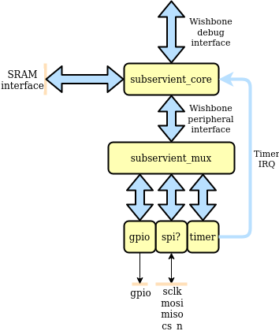
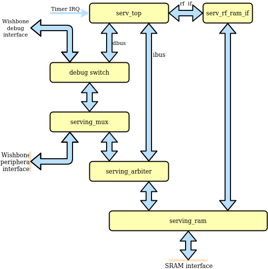

# subservient
Small SERV-based SoC primarily for OpenMPW tapeout

## Architecture

### Top-level

### Subservient core

TODO:
- [ ] Test on FPGA
- [ ] Add OpenRAM
- [ ] Add support for loading the SRAM externally (over Wishbone from Caravel)
- [ ] Gate-level simulations
