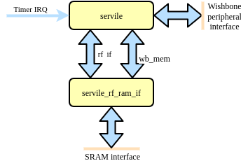

# subservient
Small SERV-based SoC primarily for OpenMPW tapeout

## Introduction

Subservient is a small SoClet around the award-winning SERV, the world's smallest RISC-V CPU intended to be used for ASIC implementations. The SoClet exposes a port intended to be connected to be connected to an SRAM used for both the register file and data/instruction memory, a debug interface for external access to the SoC memory map and GPIO.

## Architecture

### Top-level

The top-level of Subservient consists of the subservient_core component which contains all the vital SoC infrastructure, and the standard peripheral controllers, currently only consisting of GPIO. This is a convenience wrapper for users who are happy with the standard set of peripherals.

### Subservient core

Subservient core contains SERV and the necessary components to use a single SRAM for SERV's register file, data and instruction memories. It also routes all memory accesses >=0x40000000 to the wishbone peripheral interface. In the debug mode, the debug interface takes over the accesses from SERV. This allows an external wishbone master to access all subservient peripherals as well as programming the SRAM through this interface.

TODO:
- [ ] Test on FPGA
- [ ] Add OpenRAM
- [ ] Add support for loading the SRAM externally (over Wishbone from Caravel)
- [ ] Gate-level simulations
